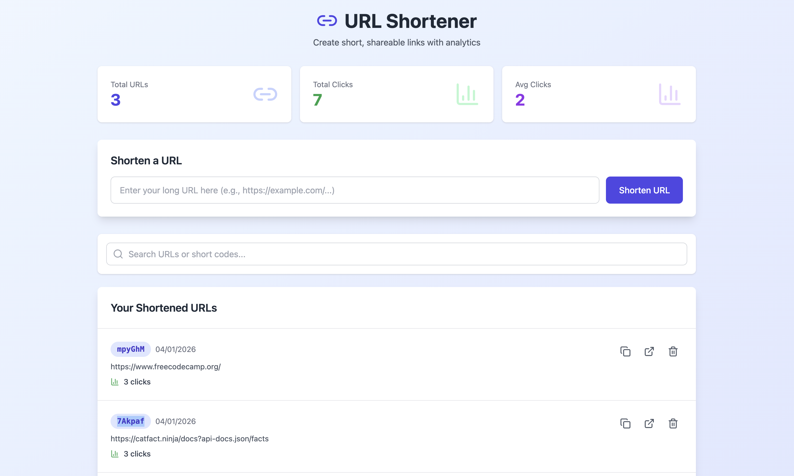

# 🔗 URL Shortener  
### 🚀 A Modern MERN Stack Application

<p align="center">
  
  
  
  
</p>

<p align="center">
  <b>Shorten. Share. Track.</b><br/>
  A full-stack URL shortener built with the MERN stack.
</p>
<p align="center">
  
  
  
  
  
</p>


## 🌐 Live Project
- **Frontend:** https://url-shortener-phi-blush.vercel.app/
- **Backend API:** https://url-shortener-1gfv.onrender.com  


## ✨ Features
- 🔗 Convert long URLs into short, shareable links
- 🚀 Instant redirection to original URLs
- 📊 Real-time click analytics
- 🔁 Duplicate URL detection
- 🔍 Search shortened URLs
- 🗑️ Delete URLs
- 📱 Fully responsive design


## 🛠 Tech Stack

### Frontend
- React.js (Vite)
- Tailwind CSS

### Backend
- Node.js
- Express.js

### Database
- MongoDB
- Mongoose ODM

### Utilities
- Nanoid
- CORS


## 📸 Screenshots

### 🖥️ Dashboard &  🔗 URL Shortening



> 📌 Screenshots taken from the live deployed application<br>
📁 Folder location
```
screenshots/
 ├── dashboard.png
 ```


## 📌 API Endpoints

| Method | Endpoint | Description |
|------|---------|------------|
| POST | `/api/shorten` | Create short URL |
| GET | `/api/urls` | Fetch all URLs |
| GET | `/:shortCode` | Redirect to original URL |
| DELETE | `/api/urls/:id` | Delete a URL |


## 📂 Project Structure
```
url-shortener/
├── backend/
├── frontend/
├── screenshots/
│   ├── dashboard.png
├── README.md
└── .gitignore
```


## 👤 Author
**Sanskar Pawar**  
GitHub: https://github.com/sans-algo


⭐ Star this repository if you found it helpful!


